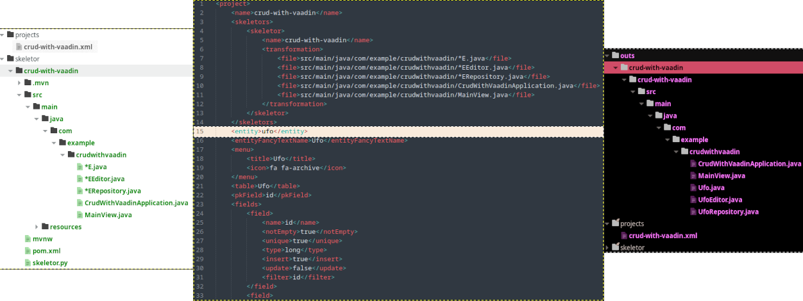

<p align="center">

</p>

<p align="center">
sgCodGen - Tool written in Python for scaffolding code generation from a XML project layout file and a base "skeletor" directory, a mold with "holes or placeholders" to be complete with the data inside XML project layout.
</p>

<p align="center">

</p>

## About sgCodGen

**sgCodGen** Tool written in Python for scaffolding code generation from a XML project layout file and a base "skeletor" directory, a mold with "holes or placeholders" to be complete with the data inside XML project layout.
The "skeletor" structure could also contain files with "special transformations" defining [XPath 1.0](https://www.w3.org/TR/xpath-10/) expressions inside and a special "skeletor.py" package with custom specific project functions: 
*   **boundary symbols to hold invocations to special function or XPath expression to generate lists, or single values**
    *   `<<<`(special function / XPath expr)`>>`

*   **hole symbols to point where and how (using special functions or XPath expressions) put the data**
    *   `>>>`(special function / XPath expr)`<<`

Further syntax usage explanation in a special manual for "skeletor.py" base package in next releases :)

The intention is to have a CRUD code generator for multiple technologies at once, this is one XML project file for multiple languages / frameworks / technologies (SpringBoot, FLASK, etc).

## Installation
*   `git clone https://github.com/gorkicode/sgCodGen.git`

**This project utilizes pipenv as package manager:**

*   if you don't have pipenv installed can run this: `sudo pacman -Sy python-pipenv`
    *   **for this early version 0.1.0-alpha.2 (from 2018), sgCodGen is using Python 3.7.0** and at least you have it as your main Python system you must install the gorgeous [**pyenv**](https://github.com/pyenv/pyenv) (for managing different Python versions in a isolated way from others) and the **pyenv-virtualenv plugin** like [**this**](#configuring-the-old-python-environment-june-2018-of-the-project-in-a-new-linux-2024-developer-environment)

## How It Works

<p align="center">

</p>

*   **INPUT:**
    *   `<SkeletorProjectFolder>`
        *   (the mold) into "skeletor" directory with "skeletor.py" package for special project transformation functions (the left block in the example image)
    *   `<ProjectLayout.xml>`
        *   (data for the mold holes and their productions) into "projects" directory (the middle block in the example image)

*   **OUTPUT:**
    *   `<OutsFolder>`
        *   "outs" directory with the productions, the "scaffold structure" generated per project (the right block in the example image)

## Usage

*   `python sgCodGen.py --projectFileName <projectFile NameInProjectsFolderWithOut.Xml>`

## Extras

This release comes with the skeletor example "crud-with-vaadin" a SpringBoot minimal CRUD bundled with vaadin 24.4.2 for the frontend technology. Also this project has a patched dependency for the "Free & Open Source version of vaadin 24.4.2" the 
**vaadin-dev-server-24.4.2-noUserStat.jar** (dependency specified into the maven file) which avoid the annoying behavior of create .vaadin directory in developer machine and the sending of statistics to vaadin.

## Configuring the old Python environment (June 2018) of the project in a new Linux 2024 developer environment

This is the correct way for not fall down into a loop of warnings and missing libraries errors at building time ,due the difference of technologies of old versions and the incompatibility between new version of pipenv and old Python releases (as the error ImportError: cannot import name 'cached_property' from 'functools').

**Steps:**

* **1) Installation of [pyenv](https://github.com/pyenv/pyenv) (awesome tool for Python version management in a isolated way from main system version)**

IN MANJARO (ARCH LINUX DISTRIBUTION)

* **2) Required System dependencies (build environment) and [for other linux distributions...](https://github.com/pyenv/pyenv/wiki#suggested-build-environment)**
    *   `sudo pacman -Sy --needed base-devel openssl zlib xz tk`
        *   Will be necessary an updated linux system to avoid the classic error: **failed to commit transaction (invalid or corrupted package (PGP signature))**, but if you don't wanna that, always can update only the "keyring" like this: `sudo pacman -Sy archlinux-keyring`

*   `sudo pacman -Sy pyenv`

* **3) Set up your shell (BASH) environment for pyenv and [for other shell...](https://github.com/pyenv/pyenv#set-up-your-shell-environment-for-pyenv)**

    Copy and past this two blocks in your terminal:

    ~~~ bash
    echo 'export PYENV_ROOT="$HOME/.pyenv"' >> ~/.bashrc
    echo 'command -v pyenv >/dev/null || export PATH="$PYENV_ROOT/bin:$PATH"' >> ~/.bashrc
    echo 'eval "$(pyenv init -)"' >> ~/.bashrc
    ~~~

    ~~~ bash
    echo 'export PYENV_ROOT="$HOME/.pyenv"' >> ~/.profile
    echo 'command -v pyenv >/dev/null || export PATH="$PYENV_ROOT/bin:$PATH"' >> ~/.profile
    echo 'eval "$(pyenv init -)"' >> ~/.profile
    ~~~

    And for changes to take effect:
    ```sh
    exec "$SHELL"
    ```

    Restart!

* **4) Install the fantastic pyenv-virtualenv plugin (Virtual Environment) from GitHub:**

    ~~~ bash
    sudo git clone https://github.com/pyenv/pyenv-virtualenv.git /usr/share/pyenv/plugins/pyenv-virtualenv
    echo 'eval "$(pyenv virtualenv-init -)"' >> ~/.bashrc
    exec "$SHELL"
    ~~~

    Restart!

    This that we have done makes the magic that when enter (in terminal) into a project directory with a particular Python version (and packages) this automatically be activated.

    **Restart! but if you are going to reboot, in some cases your Arch Linux could not start, then:**
    - boot into Grub, remove **quiet** and add **3** (runlevel 3)
    - login and comment the `eval "$(pyenv virtualenv-init -)` in ~/.bashrc
    - reboot
    - login normally and uncomment the `#eval "$(pyenv virtualenv-init -)` in ~/.bashrc
    
    **or you must activate / deactivate your pyenv environment per project manually**

    If you want to know about this great tool, at this point I recommend read this terrific [article](https://realpython.com/intro-to-pyenv/)


* **5) Next we are going to install Python 3.7.0 in a non-intrusive way by building from source and install it in the local machine by typing:** `pyenv install 3.7.0` **in terminal**

* **5) Get sgCodGen by typing:** `git clone https://github.com/gorkicode/sgCodGen.git` **in terminal**

* **6) Then type (in terminal, obviously):** `pyenv virtualenv 3.7.0 sgCodGen` **and inside sgCodGen directory type:** `pyenv local sgCodGen` **this will configure a virtual environment with Python 3.7.0 called sgCodGen for the current directory**

* **7) Install pipenv iside the virtualenv with pip like this:** `pip install pipenv`

## 8) Installing dependencies

(always in terminal obviously):

* **Finally and inside the sgCodGen directory install dependencies from Pipfile.lock with:** `pipenv install`

---

## Donations

Donate and follow me to support my projects, thank you! :)

<a href="https://www.buymeacoffee.com/gorkicode" target="_blank"></a>

[](https://cafecito.app/gorkicode)
